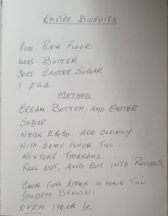

# Gran's Empire Biscuits

Oven 🔥 - 170°C 

Time ⏲️ - ~40 minutes

## Ingredients 

- 8oz / 225g plain flour
- 4oz / 112.5g butter 🧈
- 3oz / 85g caster sugar
- 1 egg 🥚
- icing sugar
- glazed cherry 🍒
- strawberry jam 🍓

## Instructions 📝

1. Cream butter and caster sugar together.
2. Whisk your egg in a cup.
3. Add whisked egg slowly to combined butter and sugar until mixture thickens. 
4. Roll the mixture out and cut into circles. Place on buttered baking paper, on baking tray in oven.
5. Cook for approximately ten minutes until golden brown. 
6. Wait for the biscuits to cool. 
7. Make your icing. 
8. Add the icing to your biscuits.
9. Add the glazed cherry (optional).
10. Allow time for the icing to set. 
11. Enjoy. 😁

## Original 

